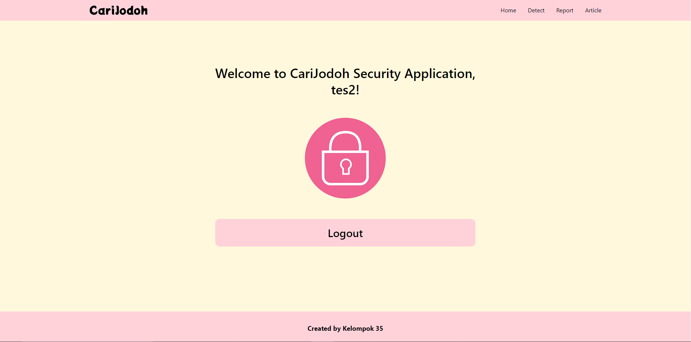
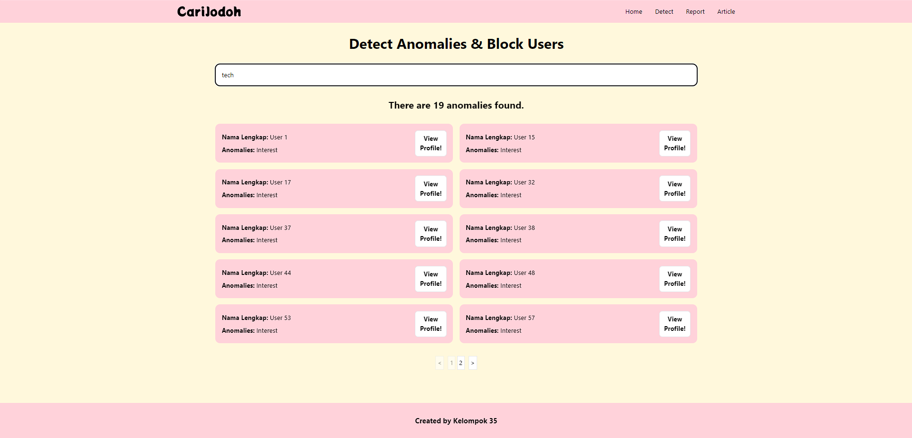
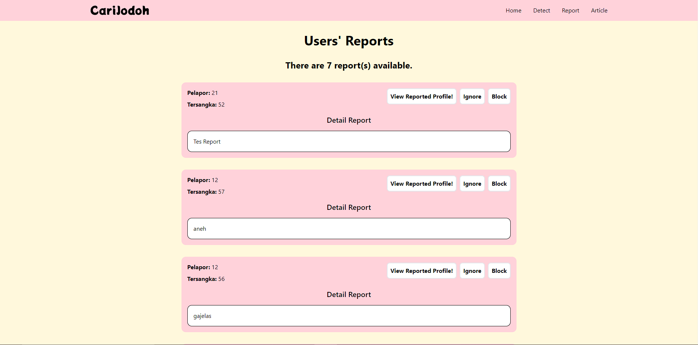
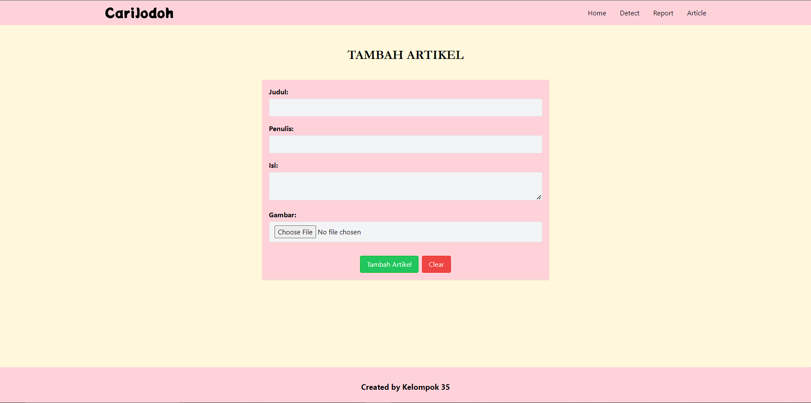
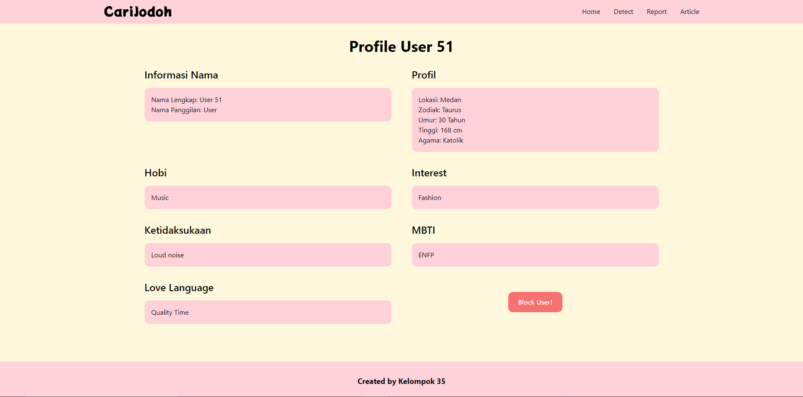
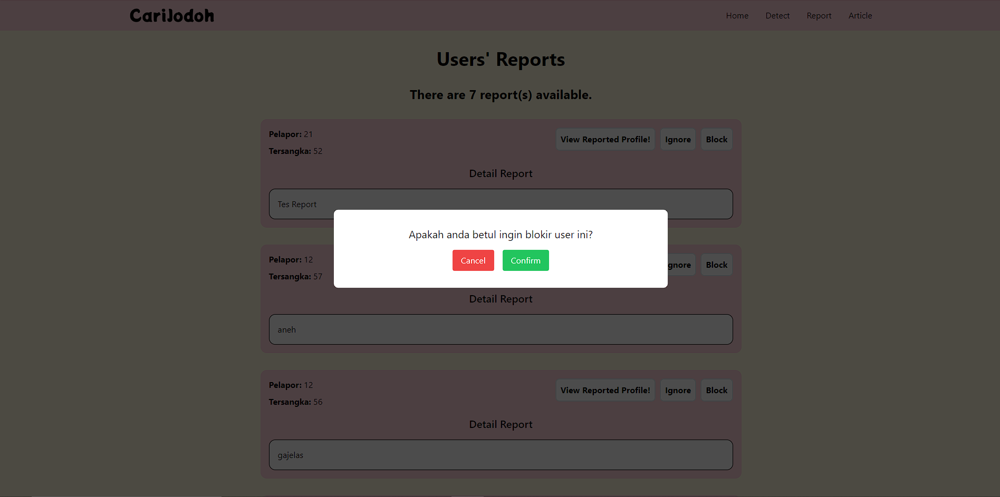
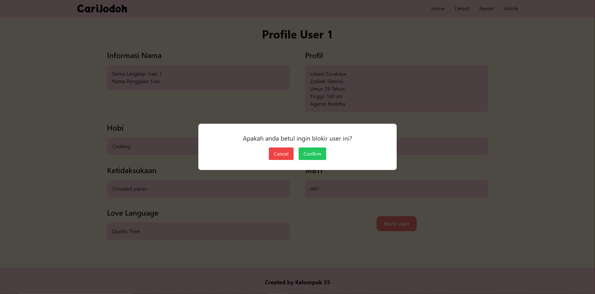

# SPA: Aplikasi _Security_ CariJodoh

## Deskripsi Singkat

> <h3>Selamat datang kembali para pejuang cinta!</h3>

    
CariJodoh adalah sebuah perangkat lunak berbasis web yang memungkinkan penggunanya mencari calon kekasih, sesuai dengan kriteria masing-masing, dalam hitungan menit! Tentunya, CariJodoh perlu memiliki dukungan keamanan yang memadai. Oleh karena itu, disediakan aplikasi yang akan digunakan oleh <i>security</i> untuk memantau aktivitas setiap pengguna.

    

    
Di sini, <i>security</i> dapat mendeteksi anomali data pengguna, menerima daftar laporan yang dilakukan oleh pengguna terhadap pengguna lain, melihat profil pengguna yang dilaporkan/dicurigai, memblokir pengguna, hingga menulis artikel tentang kencan untuk dibaca oleh pengguna.

## Beberapa Tangkapan Layar Aplikasi
- Fitur _Login_
  - 
- Fitur _Register_
  - 
- Fitur _Homepage_
  - 
- Fitur _Detect Anomalies_
  - 
- Fitur _Reported Users_
  - 
- Fitur Tambah Artikel
  - 
- Fitur _Block User_
  - 
  - 
  - 

  ## Pembagian Tugas

|        Halaman       |        Jenis         |       NIM Pembuat        |
| :------------------: | :------------------: | :----------------------: |
|       _Login_        |      _Frontend_      | `13521XXX` `13521XXX` |
|      _Register_      |      _Frontend_      |        `13521XXX`        |
|        _Home_        |      _Frontend_      |        `13521XXX`        |
|       _Detect_       |      _Frontend_      |        `13521XXX`        |
|       _Report_       |      _Frontend_      |        `13521XXX`        |
|  _Suspected Profile_ |      _Frontend_      |        `13521XXX`        |
|    Tambah Artikel    |      _Frontend_      |        `13521XXX`        |
|       _Header_       |      _Frontend_      |        `13521XXX`        |
|       _Footer_       |      _Frontend_      |        `13521XXX`        |
|     _Pagination_     |      _Frontend_      |        `13521XXX`        |
|   _Confirm Pop Up_   |      _Frontend_      |        `13521XXX`        |