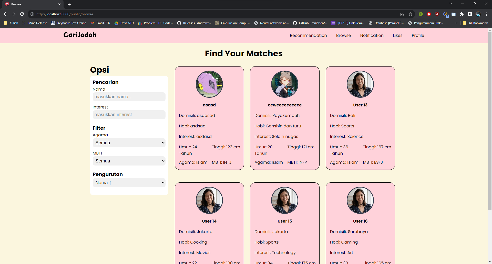

# Aplikasi Berbasis Web: CariJodoh

{width=50%}

## Deskripsi Singkat

> <h3>Halo para pejuang cinta!</h3>

<div align="justify">
    <p>CariJodoh adalah sebuah perangkat lunak berbasis web yang memungkinkan Anda menemukan calon kekasih dalam hitungan menit. Anda bisa mencari pengguna lain berdasarkan nama, minat, agama, hingga MBTI. Bagi Anda yang pemalu atau malas mencari, jangan khawatir, sebab CariJodoh juga menyediakan beranda berisi rekomendasi orang untuk Anda! Temukan seseorang yang cocok dengan Anda, langsung sukai profilnya dan atur jadwal kencan, ya. Segera daftarkan diri di CariJodoh dan buat profilmu semenarik mungkin bagi para pencari pasangan!</p>
</div>

---

## _Requirements_

- Docker Desktop. [Klik _link_ ini untuk melakukan instalasi](https://www.docker.com/products/docker-desktop/).

## Instalasi

1. _Clone_ repositori ini dengan memasukkan _script_ berikut pada terminal

```
git clone -b main https://gitlab.informatika.org/if3110-2023-k02-01-35/tugas-besar-1.git
```

## Menjalankan Server

1. Buka Docker Desktop.
2. Buatlah file .env menggunakan format dari .env.example
3. Jalankan _script_ berikut setelah masuk ke folder hasil _clone_ pada terminal

```
docker build -t tubes-1:latest .
```

4. Jalankan _script_ berikut pada terminal

```
docker compose up -d
```

5. Jalankan _script_ berikut pada terminal untuk membuat _user seed_

```
docker exec -it tugas-besar-1-web-1 php "./app/seed/seed_users.php"
```

6. Jalankan _script_ berikut pada terminal untuk membuat _admin seed_

```
docker exec -it tugas-besar-1-web-1 php "./app/seed/seed_admin.php"
```

7. Jalankan dua _command_ berikut untuk memberikan akses _image_ dan _video_.

```
docker exec -it tugas-besar-1-web-1 chmod -R 777 /var/www/html/public/videos
```

```
docker exec -it tugas-besar-1-web-1 chmod -R 777 /var/www/html/public/images/profile
```

8. Buka _browser_ favorit dan masukkan URL berikut untuk memulai aplikasi

```
http://localhost:8080/public/user/login
```

## Beberapa Tangkapan Layar Aplikasi

- Fitur _Login_
  - 
- Fitur _Register_
  - 
  - 
  - 
- Fitur _Recommendation_
  
- Fitur _Browse_
  - 
  - 
- Fitur _Profile_
  - 
  - 
  - 
- Fitur _Edit Profile_
  - 
- Fitur _Like User_
  - 
- Fitur _Notification_
  - 
- Fitur _Likes_
  - 
- Fitur _Admin-Dashboard_
  - 
- Fitur _Admin-User_
  - 
  - 
  - 
  - 
  - 
- Fitur _Admin-Notification_
  - 
  - 
  - 
- Fitur _Admin-Likes_
  - 
  - 
  - 
- Fitur _Pagination_
  - 
- Fitur _Not Found_
  - 

## Pembagian Tugas

|        Fitur         |        _Side_        |       NIM Pembuat        |
| :------------------: | :------------------: | :----------------------: |
|       _Login_        | _Client_<br>_Server_ | `13521140`<br>`13521124` |
|      _Register_      | _Client_<br>_Server_ | `13521140`<br>`13521124` |
|       _Browse_       | _Client_<br>_Server_ | `13521169`<br>`13521169` |
|   _Recommendation_   | _Client_<br>_Server_ | `13521124`<br>`13521124` |
|      _Profile_       | _Client_<br>_Server_ | `13521140`<br>`13521169` |
|    _Edit Profile_    | _Client_<br>_Server_ | `13521169`<br>`13521169` |
|     _Like User_      | _Client_<br>_Server_ | `13521140`<br>`13521140` |
|    _Notification_    | _Client_<br>_Server_ | `13521124`<br>`13521124` |
|       _Likes_        | _Client_<br>_Server_ | `13521124`<br>`13521140` |
|  _Admin-Dashboard_   | _Client_<br>_Server_ | `13521124`<br>`13521124` |
|     _Admin-User_     | _Client_<br>_Server_ | `13521124`<br>`13521124` |
| _Admin-Notification_ | _Client_<br>_Server_ | `13521124`<br>`13521124` |
|    _Admin-Likes_     | _Client_<br>_Server_ | `13521124`<br>`13521124` |
|       _Header_       |       _Client_       |        `13521124`        |
|       _Footer_       |       _Client_       |        `13521124`        |
|     _Pagination_     | _Client_<br>_Server_ | `13521124`<br>`13521169` |
|     _Not Found_      | _Client_<br>_Server_ | `13521124`<br>`13521124` |

## BONUS: Hasil Tes Google Lightouse

<div align="justify">
    <p>Berikut adalah beberapa tangkapan layar hasil terbaik dari pengujian setiap halaman dengan menggunakan Google Lighthouse. Detail nilai untuk setiap halaman dapat dilihat pada tabel di bawah.</p>
</div>


|       Halaman        | _Performance_ | _Accessibility_ | _Best Practices_ |
| :------------------: | :-----------: | :-------------: | :--------------: |
|       _Login_        |      100      |       95        |       100        |
|      _Register_      |      100      |       95        |       100        |
|   _Recommendation_   |      100      |       95        |       100        |
|       _Browse_       |      98       |       96        |       100        |
| _User Notification_  |      95       |       100       |       100        |
|     _User Likes_     |      95       |       100       |       100        |
|     _My Profile_     |      99       |       100       |       100        |
|  _Other's Profile_   |      100      |       95        |       100        |
|  _Admin-Dashboard_   |      100      |       95        |       100        |
|    _Admin-Users_     |      98       |       96        |       100        |
|  _Admin-View-Users_  |      100      |       100       |        92        |
| _Admin-Notification_ |      84       |       97        |       100        |
|    _Admin-Likes_     |      82       |       97        |       100        |
