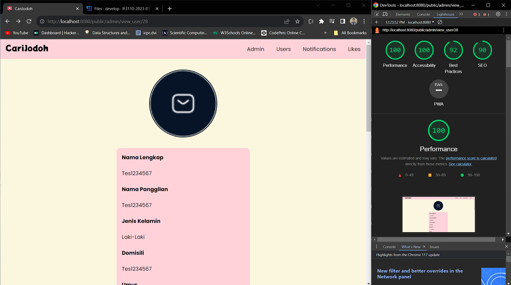

# Aplikasi Berbasis Web: CariJodoh

{width=50%}

---
# _UPDATES_
## Deskripsi Singkat Pembaharuan

> <h3>Selamat <i>dating</i> lagi para pejuang cinta!</h3>

<div align="justify">
    <p>Teruntuk kalian yang masih mencari cinta sejati, CariJodoh kembali hadir dengan beragam fitur baru yang tidak kalah menarik! Pokoknya, jangan sampai ketinggalan menggunakan <i>chat</i> untuk mengobrol dengan calon pasangan Anda! Laporkanlah pengguna yang menurut Anda patut dicurigai atau tidak bertingkah semestinya. Pada versi terbaru kami ini, tersedia pula berbagai artikel tentang kencan yang bisa Anda baca untuk memperoleh tips dan trik memperlancar hubungan Anda.</p>
    <p>Anda juga dapat menghapus seluruh <i>chat</i> Anda dengan satu per satu teman Anda di sini. Namun jangan khawatir, keamanan data Anda tetap menjadi prioritas kami, dengan kehadiran <b>Tim <i>Security</i> CariJodoh!</b></p>
</div>

## Beberapa Tangkapan Layar Tambahan Fitur
- Fitur _Chat_ dan _Delete Chat_
  - 
  - 
- Fitur _Report User_
  - 
- Fitur Baca Artikel
  - 

## OWASP Handling
Dilakukannya beberapa OWASP Handling yaitu HTML CSS Injection, File Upload Vulnerabilities, SQL Injection, dan HTTP Parameter Pollution

## SQL Injection
Injeksi adalah trik yang dilakukan terhadap aplikasi dengan cara mengirimkan data berupa command yang “tidak diinginkan” ke interpreter. Interpreter, seperti SQL, OS Shell, LDAP, XPath, Hibernate, atau lainnya, langsung mengambil string masukan mentah-mentah lalu mengeksekusinya. SQL injection masih rentan terjadi di berbagai aplikasi, padahal pencegahannya mudah. Jika sampai terjadi, dampaknya bisa parah, karena seisi basis data bisa dibaca hingga diubah. Penyerang mendapatkan akses terhadap akun pengguna, bahkan akses di level sistem operasi.

Cara mengatasi potensi serangan SQL Injection dalam implementasi class Database adalah dengan menggunakan parameterized query. Pada kelas Database, terdapat metode bind yang digunakan untuk menyisipkan parameter ke dalam query. 

## HTML CSS Injection
Injeksi HTML dikenal juga sebagai XSS (Cross-Site Scripting), terjadi ketika data mentah dari penyerang dikirim ke browser pengguna. Ada berbagai metode dan atribut yang dapat digunakan untuk me-render konten HTML. Jika dibiarkan berjalan dengan masukan yang tidak dibersihkan dan keluarannya tidak di-encode, injeksi HTML menjadi rentan. Akibatnya, penyerang bisa mencuri session dan data sensitif pengguna, menyamar sebagai pengguna, menulis ulang halaman web, hingga redirect pengguna ke situs penipuan atau malware.

Cara mengatasinya adalah dengan penggunaan Content Security Policy (CSP) pada header seluruh file HTML. CSP adalah mekanisme keamanan yang memungkinkan pengaturan kebijakan untuk mengendalikan sumber daya yang diizinkan di halaman web dan memitigasi risiko XSS. Dapat dilihat pada seluruh components file html memiliki meta CSP dalam headernya.

## File Upload Vulnerabilities
Kerentanan ini adalah masalah aplikasi berbasis web, yang memungkinkan hacker mengunggah file, yang di dalamnya terdapat kode berbahaya, untuk dieksekusi di server. Lagi-lagi, hacker dapat memasukkan halaman phishing ke dalam situs web atau merusak situs web tersebut. Lebih bahaya lagi, hacker akan mendapat beberapa informasi internal server web kemudian menjualnya.

Cara untuk menghandlenya adalah dengan memeriksa file yang telah diupload oleh user apakah tipenya image atau video. Dapat dilihat implementasinya pada register dan update profile.

## HTTP Parameter Pollution
Polusi Parameter HTTP adalah salah satu masalah keamanan web yang menguji respons aplikasi, ketika menerima beberapa parameter HTTP dengan nama yang sama. Misalnya, parameter nama pengguna disertakan sebagai parameter GET atau POST sebanyak dua kali.

Cara handlenya adalah dengan memastikan bahwa parameter dari setiap request front-end tidak memiliki parameter yang duplikat. Dapat dilihat pada setiap request tidak ada parameter yang duplikat.

## Pembagian Tugas (Tambahan Fitur)

|        Fitur         |          Jenis          |       NIM Pembuat        |
| :------------------: | :---------------------: | :----------------------: |
|        _Chat_        | _Frontend_<br>_Backend_ | `13521169`<br>`13521169` |
|    _Delete Chat_     | _Frontend_<br>_Backend_ | `13521140`<br>`13521169` |
|    _Report User_     | _Frontend_<br>_Backend_ | `13521124`<br>`13521124` |
|     Baca Artikel     | _Frontend_<br>_Backend_ | `13521169`<br>`13521124` |


---
## Deskripsi Singkat

> <h3>Halo para pejuang cinta!</h3>

<div align="justify">
    <p>CariJodoh adalah sebuah perangkat lunak berbasis web yang memungkinkan Anda menemukan calon kekasih dalam hitungan menit. Anda bisa mencari pengguna lain berdasarkan nama, minat, agama, hingga MBTI. Bagi Anda yang pemalu atau malas mencari, jangan khawatir, sebab CariJodoh juga menyediakan beranda berisi rekomendasi orang untuk Anda! Temukan seseorang yang cocok dengan Anda, langsung sukai profilnya dan atur jadwal kencan, ya. Segera daftarkan diri di CariJodoh dan buat profilmu semenarik mungkin bagi para pencari pasangan!</p>
</div>

---

## _Requirements_

- Docker Desktop. [Klik _link_ ini untuk melakukan instalasi](https://www.docker.com/products/docker-desktop/).

## Instalasi

1. _Clone_ repositori ini dengan memasukkan _script_ berikut pada terminal

```
git clone -b main https://gitlab.informatika.org/if3110-2023-k02-01-35/tugas-besar-1.git
```

## Menjalankan Server

1. Buka Docker Desktop.
2. Buatlah file .env menggunakan format dari .env.example
3. Jalankan _script_ berikut setelah masuk ke folder hasil _clone_ pada terminal

```
docker build -t tubes-1:latest .
```

4. Jalankan _script_ berikut pada terminal

```
docker compose up -d
```

5. Jalankan _script_ berikut pada terminal untuk membuat _user seed_

```
docker exec -it tugas-besar-1-v3-web-1 php "./app/seed/seed_users.php"
```

6. Jalankan _script_ berikut pada terminal untuk membuat _admin seed_

```
docker exec -it tugas-besar-1-v3-web-1 php "./app/seed/seed_admin.php"
```

7. Jalankan dua _command_ berikut untuk memberikan akses _image_ dan _video_.

```
docker exec -it tugas-besar-1-v3-web-1 chmod -R 777 /var/www/html/public/videos
```

```
docker exec -it tugas-besar-1-v3-web-1 chmod -R 777 /var/www/html/public/images/profile
```

8. Buka _browser_ favorit dan masukkan URL berikut untuk memulai aplikasi

```
http://localhost:8080/public/user/login
```

## Beberapa Tangkapan Layar Aplikasi

- Fitur _Login_
  - 
- Fitur _Register_
  - 
  - 
  - 
- Fitur _Recommendation_
  
- Fitur _Browse_
  - 
  - 
- Fitur _Profile_
  - 
  - 
  - 
- Fitur _Edit Profile_
  - 
- Fitur _Like User_
  - 
- Fitur _Notification_
  - 
- Fitur _Likes_
  - 
- Fitur _Admin-Dashboard_
  - 
- Fitur _Admin-User_
  - 
  - 
  - 
  - 
  - 
- Fitur _Admin-Notification_
  - 
  - 
  - 
- Fitur _Admin-Likes_
  - 
  - 
  - 
- Fitur _Pagination_
  - 
- Fitur _Not Found_
  - 

## Pembagian Tugas

|        Fitur         |        _Side_        |       NIM Pembuat        |
| :------------------: | :------------------: | :----------------------: |
|       _Login_        | _Client_<br>_Server_ | `13521140`<br>`13521124` |
|      _Register_      | _Client_<br>_Server_ | `13521140`<br>`13521124` |
|       _Browse_       | _Client_<br>_Server_ | `13521169`<br>`13521169` |
|   _Recommendation_   | _Client_<br>_Server_ | `13521124`<br>`13521124` |
|      _Profile_       | _Client_<br>_Server_ | `13521140`<br>`13521169` |
|    _Edit Profile_    | _Client_<br>_Server_ | `13521169`<br>`13521169` |
|     _Like User_      | _Client_<br>_Server_ | `13521140`<br>`13521140` |
|    _Notification_    | _Client_<br>_Server_ | `13521124`<br>`13521124` |
|       _Likes_        | _Client_<br>_Server_ | `13521124`<br>`13521140` |
|  _Admin-Dashboard_   | _Client_<br>_Server_ | `13521124`<br>`13521124` |
|     _Admin-User_     | _Client_<br>_Server_ | `13521124`<br>`13521124` |
| _Admin-Notification_ | _Client_<br>_Server_ | `13521124`<br>`13521124` |
|    _Admin-Likes_     | _Client_<br>_Server_ | `13521124`<br>`13521124` |
|       _Header_       |       _Client_       |        `13521124`        |
|       _Footer_       |       _Client_       |        `13521124`        |
|     _Pagination_     | _Client_<br>_Server_ | `13521124`<br>`13521169` |
|     _Not Found_      | _Client_<br>_Server_ | `13521124`<br>`13521124` |

## BONUS: Hasil Tes Google Lightouse

<div align="justify">
    <p>Berikut adalah beberapa tangkapan layar hasil terbaik dari pengujian setiap halaman dengan menggunakan Google Lighthouse. Detail nilai untuk setiap halaman dapat dilihat pada tabel di bawah.</p>
</div>





|       Halaman        | _Performance_ | _Accessibility_ | _Best Practices_ |
| :------------------: | :-----------: | :-------------: | :--------------: |
|       _Login_        |      100      |       95        |       100        |
|      _Register_      |      100      |       95        |       100        |
|   _Recommendation_   |      100      |       95        |       100        |
|       _Browse_       |      98       |       96        |       100        |
| _User Notification_  |      95       |       100       |       100        |
|     _User Likes_     |      95       |       100       |       100        |
|     _My Profile_     |      99       |       100       |       100        |
|  _Other's Profile_   |      100      |       95        |       100        |
|  _Admin-Dashboard_   |      100      |       95        |       100        |
|    _Admin-Users_     |      98       |       96        |       100        |
|  _Admin-View-Users_  |      100      |       100       |        92        |
| _Admin-Notification_ |      84       |       97        |       100        |
|    _Admin-Likes_     |      82       |       97        |       100        |
