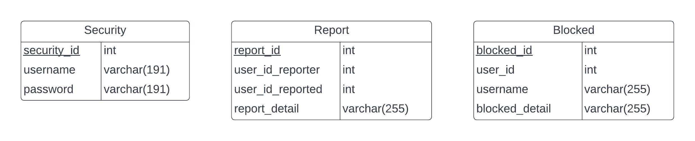

# Tugas Besar 2 - REST

## Introduction

Web Service Rest CariJodoh adalah backend dari aplikasi CariJodoh yang menggunakan arsitektur API REST. Aplikasi ini dibuat dengan menggunakan Express + Javascript + MySQL + Redis + Docker. Aplikasi ini dibuat untuk memenuhi tugas besar mata kuliah Pemrograman Aplikasi Berbasis Web.

## Overview Feature

- Express with Javascript based app
- Auth utilizing JWT
- MySQL as Database
- Dockerized
- Cached response with Redis
- SOAP calls to web service SOAP CariJodoh
- OWASP Handling (SQL Injection, HTTP Parameter Pollution, JWT Attack)

## Skema Basis Data

## Dokumentasi API

### AUTH

- /session (POST)
   Digunakan untuk melakukan login

- /session (DELETE)
   Digunakan untuk melakukan logout

- /security (POST)
   Digunakan untuk membuat akun security baru

- /security/{security_id} (GET)
   Digunakan untuk mendapatkan informasi dari suatu security berdasarkan id yang dimiliki

### Report

- /report (GET)
    Untuk mendapatkan list seluruh report

- /report (POST)
    Untuk membuat report baru

- /report/{user_id} (POST)
    Untuk memblokir suatu user berdasarkan report

- /report/{report_id} (DELETE)
    Untuk menghapus report

### Detect

- /users (GET)
    Mendapatkan list of users berdasarkan pencarian keanehan data profil pengguna

- /users/{user_id} (GET)
    Mendapatkan profile dari suatu pengguna

- /users/{user_id} (POST)
    Memblokir suatu pengguna

### Article

- /article (POST)
    Membuat suatu artikel baru

## OWASP Handling

### SQL Injection

Injeksi adalah trik yang dilakukan terhadap aplikasi dengan cara mengirimkan data berupa command yang “tidak diinginkan” ke interpreter. Interpreter, seperti SQL, OS Shell, LDAP, XPath, Hibernate, atau lainnya, langsung mengambil string masukan mentah-mentah lalu mengeksekusinya. SQL injection masih rentan terjadi di berbagai aplikasi, padahal pencegahannya mudah. Jika sampai terjadi, dampaknya bisa parah, karena seisi basis data bisa dibaca hingga diubah. Penyerang mendapatkan akses terhadap akun pengguna, bahkan akses di level sistem operasi.

Cara untuk handlenya adalah dengan parameterized query. Hal ini sudah diatasi dengan menggunakan ORM Prisma yang sudah secra otomatis membuat parameterized query untuk melindungi dari SQL Injection. Contoh implementasinya dapat dilihat pada kode bagian service.

### HTTP Parameter Pollution

Polusi Parameter HTTP adalah salah satu masalah keamanan web yang menguji respons aplikasi, ketika menerima beberapa parameter HTTP dengan nama yang sama. Misalnya, parameter nama pengguna disertakan sebagai parameter GET atau POST sebanyak dua kali.

Hal ini menyebabkan aplikasi menafsirkan nilai dengan tidak terduga. Penyerang mungkin dapat men-skip validasi input serta autentikasi, memicu kesalahan aplikasi, hingga mengubah nilai variabel internal. HTTP parameter pollution dapat menjadi serangan ke sisi server maupun klien. Contoh yang terjadi adalah manipulasi parameter untuk mendapatkan token atur ulang sandi.

Cara handlenya adalah dengan menggunakan package hpp. Package ini akan secara otomatis menghandle jika adanya parameter yang duplikat sehingga nilai parameter duplikat yang terakhir lah yang diambil.

### JWT Attack

JSON Web Tokens (JWT) adalah format standar untuk mengirim data JSON antara sistem-sistem, yang “ditandatangani” secara kriptografis. JWT terdiri dari tiga bagian: header, payload, dan signature. Signature di-generate menggunakan header dan payload, bersama dengan kunci rahasia, kemudian digunakan untuk memverifikasi keaslian serta integritas JWT. Serangan terhadap JWT memungkinkan penyerang mengubah JWT untuk meningkatkan hak aksesnya terhadap aplikasi web, atau menyamar sebagai pengguna lain.

Cara handlenya adalah dengan menggunakan http-only cookie untuk menyimpan token pada browser. Dengan approach ini, script pada browser tidak dapat mengakses token sehingga token ini tidak dapat dicuri.

## Pembagian Tugas

|   Fitur    | NIM Pembuat |
| :--------: | :---------: |
|  _Login_   | `13521124`  |
| _Register_ | `13521124`  |
|  _Detect_  | `13521124`  |
|  _Report_  | `13521124`  |
| _Profile_  | `13521169`  |
|  _Block_   | `13521169`  |
| _Article_  | `13521140`  |

#### Proudly Presented by Kelompok 35, 2023
