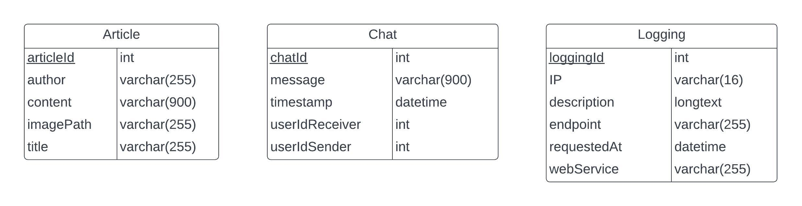

# Tugas Besar 2 - SOAP

## Introduction

Web Service SOAP CariJodoh adalah backend dari aplikasi CariJodoh yang menggunakan arsitektur API SOAP. Aplikasi ini dibuat dengan menggunakan JAX-WS + Java + MySQL + Hibernate + Docker + JavaMail. Aplikasi ini dibuat untuk memenuhi tugas besar mata kuliah Pemrograman Aplikasi Berbasis Web.

## Overview Feature

- JAX-WS with Java based app
- MySQL as Database
- Dockerized
- OWASP Handling (SQL Injection, HTTP Parameter Pollution)
- Sending emails with JavaMail using thread
- Using Hibernate as ORM

## Skema Basis Data

## Dokumentasi API

### Article

Endpoint: /article

- getAllArticles
   Digunakan untuk mendapatkan seluruh article

- createArticle
   Digunakan untuk membuat artikel baru

### Chat

Endpoint: /chat

- getChat
    Untuk mendapatkan list seluruh chat dari suatu pasangan user

- createChat
    Untuk membuat chat baru

- deleteChat
    Untuk mendelete chat dari suatu pasangan user dan mengirim email

## OWASP Handling

### SQL Injection

Injeksi adalah trik yang dilakukan terhadap aplikasi dengan cara mengirimkan data berupa command yang “tidak diinginkan” ke interpreter. Interpreter, seperti SQL, OS Shell, LDAP, XPath, Hibernate, atau lainnya, langsung mengambil string masukan mentah-mentah lalu mengeksekusinya. SQL injection masih rentan terjadi di berbagai aplikasi, padahal pencegahannya mudah. Jika sampai terjadi, dampaknya bisa parah, karena seisi basis data bisa dibaca hingga diubah. Penyerang mendapatkan akses terhadap akun pengguna, bahkan akses di level sistem operasi.

Cara untuk handlenya adalah dengan parameterized query. Hal ini sudah diatasi dengan menggunakan ORM Hibernate yang menggunakan criteria API untuk memasukkan parameter ke query.

### HTTP Parameter Pollution

Polusi Parameter HTTP adalah salah satu masalah keamanan web yang menguji respons aplikasi, ketika menerima beberapa parameter HTTP dengan nama yang sama. Misalnya, parameter nama pengguna disertakan sebagai parameter GET atau POST sebanyak dua kali.

Hal ini menyebabkan aplikasi menafsirkan nilai dengan tidak terduga. Penyerang mungkin dapat men-skip validasi input serta autentikasi, memicu kesalahan aplikasi, hingga mengubah nilai variabel internal. HTTP parameter pollution dapat menjadi serangan ke sisi server maupun klien. Contoh yang terjadi adalah manipulasi parameter untuk mendapatkan token atur ulang sandi.

Cara handlenya adalah dengan menggunakan parameter duplikat terakhir sebagai value yang ingin dipakai. Dengan implementasi Web Param, SOAP akan otomatis mengambil parameter duplikat terakhir.

## Pembagian Tugas

|     Fitur     | NIM Pembuat |
| :-----------: | :---------: |
| _Create Chat_ | `13521124`  |
|  _Get Chat_   | `13521124`  |
| _Delete Chat_ | `13521169`  |
|    _Email_    | `13521124`  |
| _Get Article_ | `13521169`  |
| _Add Article_ | `13521140`  |

#### Proudly Presented by Kelompok 35, 2023
