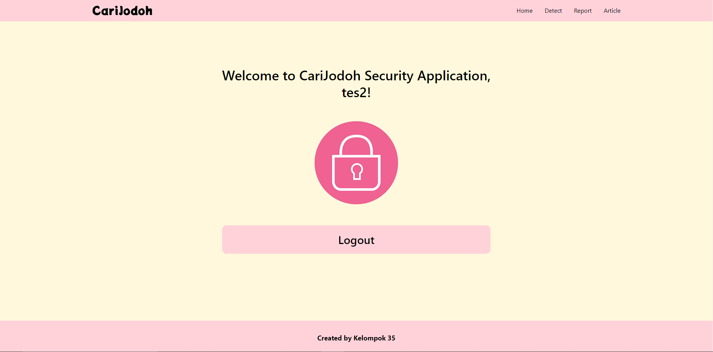
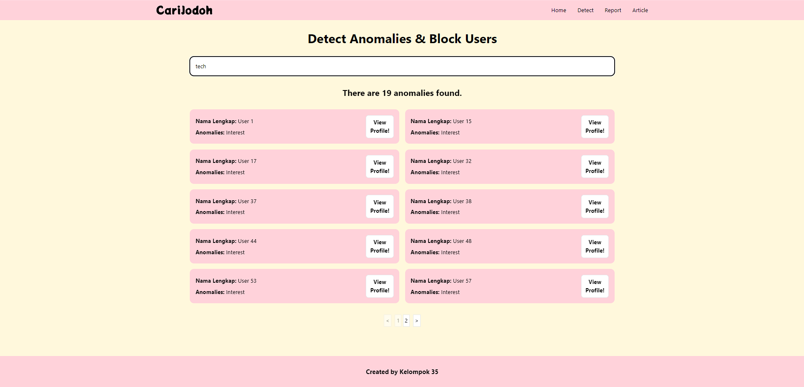
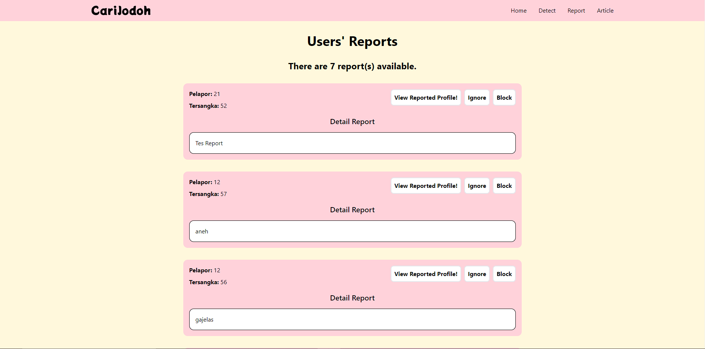
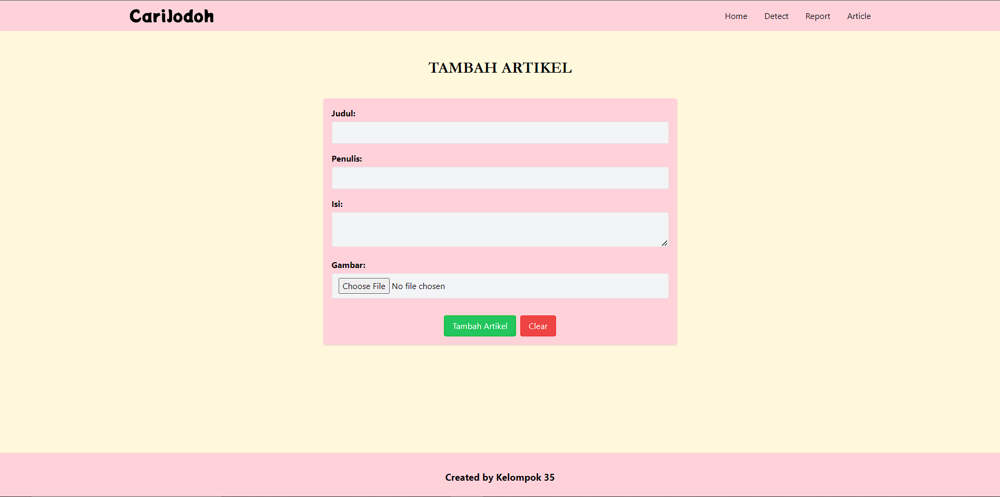
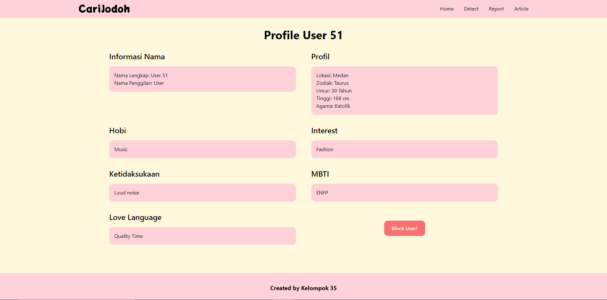
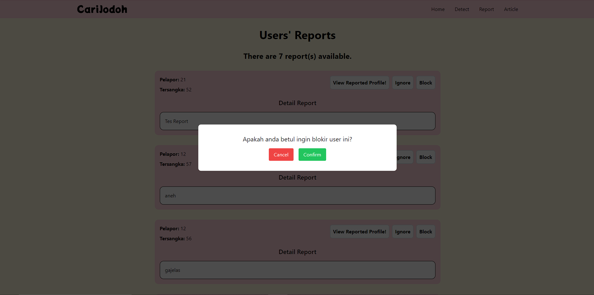
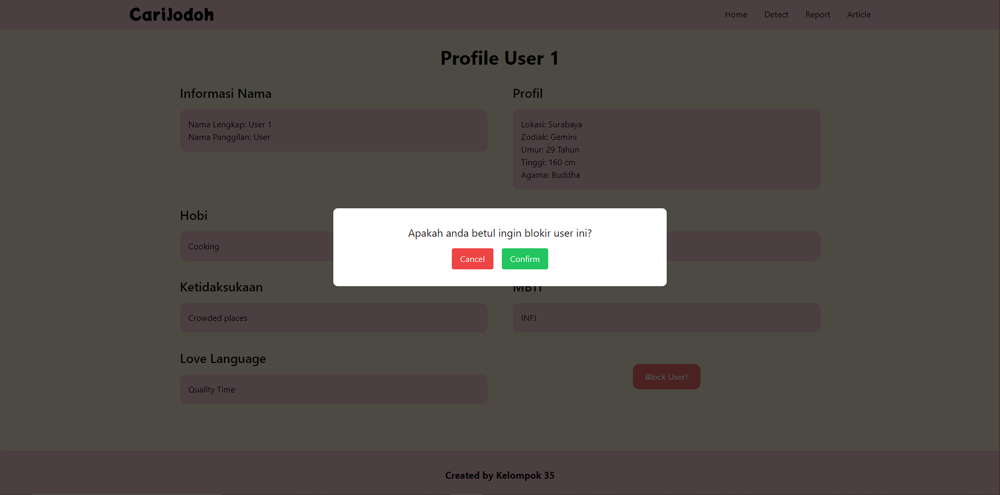

# SPA: Aplikasi _Security_ CariJodoh

## Deskripsi Singkat

> <h3>Selamat datang kembali para pejuang cinta!</h3>

    
CariJodoh adalah sebuah perangkat lunak berbasis web yang memungkinkan penggunanya mencari calon kekasih, sesuai dengan kriteria masing-masing, dalam hitungan menit! Tentunya, CariJodoh perlu memiliki dukungan keamanan yang memadai. Oleh karena itu, disediakan aplikasi yang akan digunakan oleh <i>security</i> untuk memantau aktivitas setiap pengguna.

    

    
Di sini, <i>security</i> dapat mendeteksi anomali data pengguna, menerima daftar laporan yang dilakukan oleh pengguna terhadap pengguna lain, melihat profil pengguna yang dilaporkan/dicurigai, memblokir pengguna, hingga menulis artikel tentang kencan untuk dibaca oleh pengguna.

## Beberapa Tangkapan Layar Aplikasi
- Fitur _Login_
  - 
- Fitur _Register_
  - 
- Fitur _Homepage_
  - 
- Fitur _Detect Anomalies_
  - 
- Fitur _Reported Users_
  - 
- Fitur Tambah Artikel
  - 
- Fitur _Block User_
  - 
  - 
  - 

## OWASP Handling
Pada SPA, dilakukannya OWASP handling yaitu File Upload Vulnerabilities

### File Upload Vulnerabilities
Kerentanan ini adalah masalah aplikasi berbasis web, yang memungkinkan hacker mengunggah file, yang di dalamnya terdapat kode berbahaya, untuk dieksekusi di server. Lagi-lagi, hacker dapat memasukkan halaman phishing ke dalam situs web atau merusak situs web tersebut. Lebih bahaya lagi, hacker akan mendapat beberapa informasi internal server web kemudian menjualnya.

Cara handlenya adalah dengan memeriksa tipe dari file sesungguhnya sebelum dilakukannya request pada web service REST. Karena di aplikasi memerlukan input file gambar untuk artikel, maka diperiksa terlebih dahulu tipenya apakah image atau tidak.

## Pembagian Tugas

|        Halaman       |        Jenis         |       NIM Pembuat        |
| :------------------: | :------------------: | :----------------------: |
|       _Login_        |      _Frontend_      |        `13521124`        |
|      _Register_      |      _Frontend_      |        `13521124`        |
|        _Home_        |      _Frontend_      |        `13521124`        |
|       _Detect_       |      _Frontend_      |        `13521169`        |
|       _Report_       |      _Frontend_      |        `13521140`        |
|  _Suspected Profile_ |      _Frontend_      |        `13521124`        |
|    Tambah Artikel    |      _Frontend_      |        `13521140`        |
|       _Header_       |      _Frontend_      |        `13521140`        |
|       _Footer_       |      _Frontend_      |        `13521169`        |
|     _Pagination_     |      _Frontend_      |        `13521124`        |
|   _Confirm Pop Up_   |      _Frontend_      |        `13521169`        |